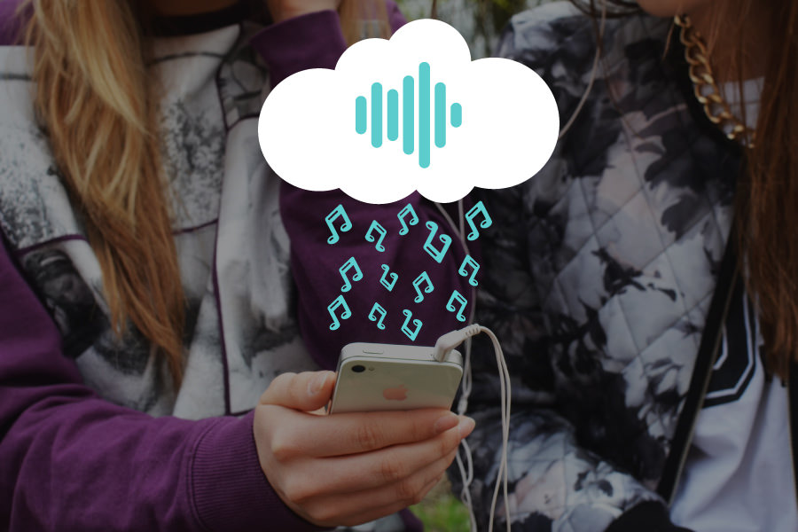

## 1. Preparing our dataset

<em>These recommendations are so on point! How does this playlist know me so well?</em>

Over the past few years, streaming services with huge catalogs have become the primary means through which most people listen to their favorite music. But at the same time, the sheer amount of music on offer can mean users might be a bit overwhelmed when trying to look for newer music that suits their tastes.

For this reason, streaming services have looked into means of categorizing music to allow for personalized recommendations. One method involves direct analysis of the raw audio information in a given song, scoring the raw data on a variety of metrics. Today, we'll be examining data compiled by a research group known as The Echo Nest. Our goal is to look through this dataset and classify songs as being either 'Hip-Hop' or 'Rock' - all without listening to a single one ourselves. In doing so, we will learn how to clean our data, do some exploratory data visualization, and use feature reduction towards the goal of feeding our data through some simple machine learning algorithms, such as decision trees and logistic regression.

To begin with, let's load the metadata about our tracks alongside the track metrics compiled by The Echo Nest. A song is about more than its title, artist, and number of listens. We have another dataset that has musical features of each track such as <code>danceability</code> and <code>acousticness</code> on a scale from -1 to 1. These exist in two different files, which are in different formats - CSV and JSON. While CSV is a popular file format for denoting tabular data, JSON is another common file format in which databases often return the results of a given query.

Let's start by creating two pandas <code>DataFrames</code> out of these files that we can merge so we have features and labels (often also referred to as <code>X</code> and <code>y</code>) for the classification later on.

<h2>Firstly : </h2>

<b>(1) :</b> we try to import libraries & save dataset into variables so we have 2 dataset so we need to merge them to get the suitable columns for the model

<b>(2) :</b> find any relationships between the features and try to remove any strong relationship   

<b>(3) :</b> Now we can split the data into train & test split features & labels   

<b>(4) :</b> i found in the new dataset the features have different scale of values so we need to make the dataset normally distributed and scalable so we will use standardScaler to scale the features in the same way 

<b>(5) :</b> After scaling data we will use PCA to reduce dimensionality or features and get the important features 

<b>(6) :</b> we can now after using Pca and train this model Now we can use some Classification Techniques like:  Decision tree Or logistic regression  

<b>(7) :</b> we can compare our result that come from logisitic regression or from Decision tree by using Classificaiton report   

<b>(8) :</b> i found the data are not balance and have issues like : bias or Overfitting so we will resample the train data & test data by using Sample Function & try again to use PCA and get the result   

<b>(9) :</b> Now We need to see how each model perform well ?  so we use cross validation with pipline & finally get the mean of score of each model  

<h1>Thank you</h1>
